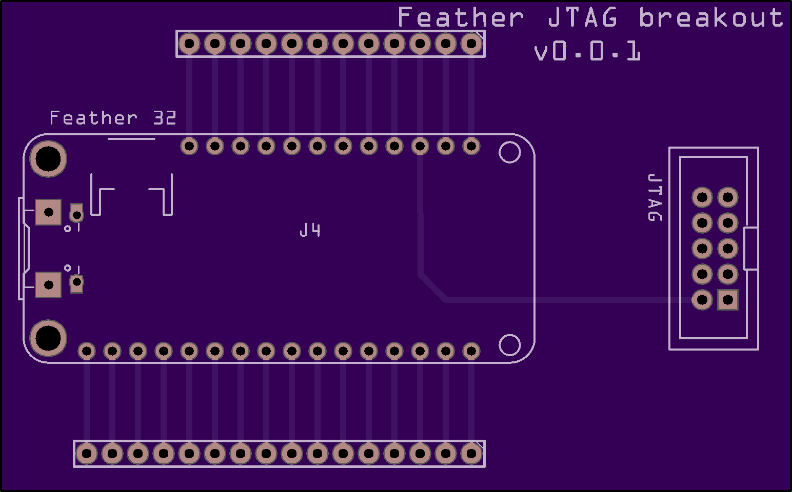
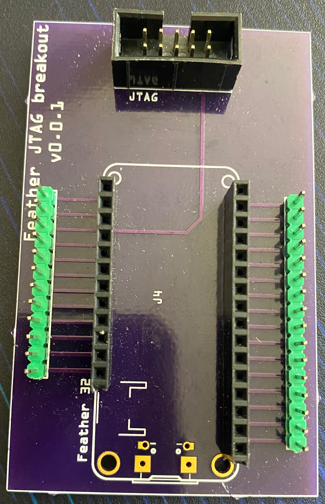
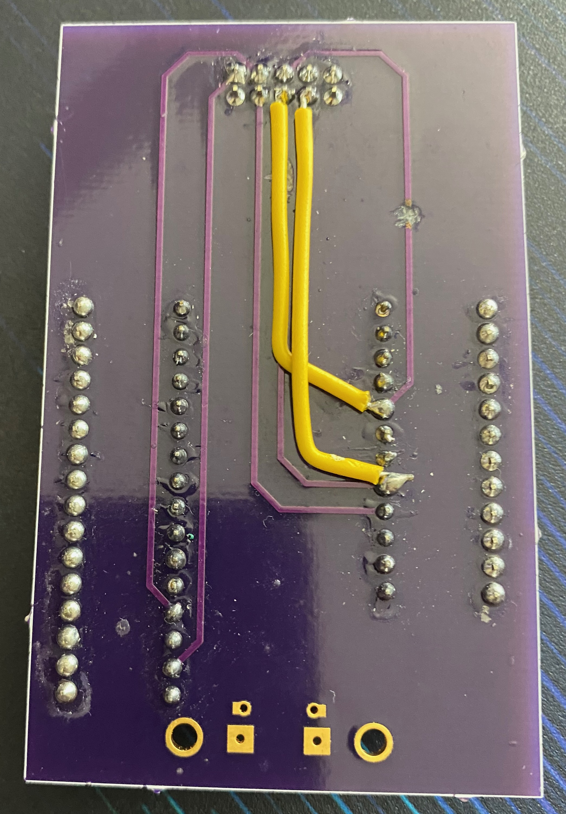

# Feather32JTAG
JTAG Breakout for Feather board for working with [ESP-Prog](https://www.digikey.com/en/products/detail/espressif-systems/ESP-PROG/10259352?utm_adgroup=Battery%20Products&utm_source=google&utm_medium=cpc&utm_campaign=Dynamic%20Search_EN_Product&utm_term=&utm_content=Battery%20Products&gclid=Cj0KCQjw8e-gBhD0ARIsAJiDsaVfdKw_ifvvSTewtMTZ36imIgWvHvOQ49ezS4xnQBE46iFW0qAG65EaAlsuEALw_wcB) debugger.

The current version has an error that requires a modification... whoops.

The prototype of the board produced by [Osh Park](https://oshpark.com)

And the whoops:

